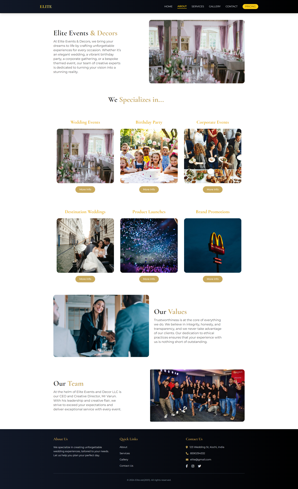
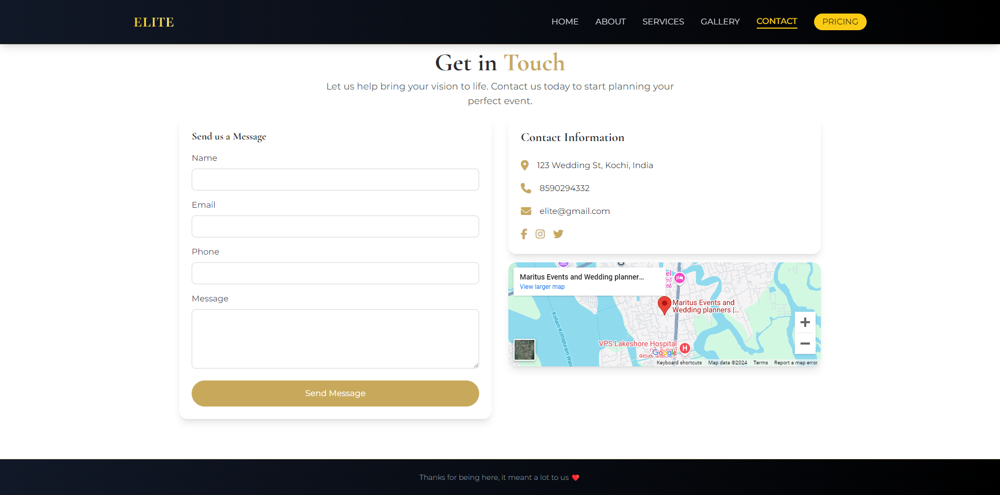
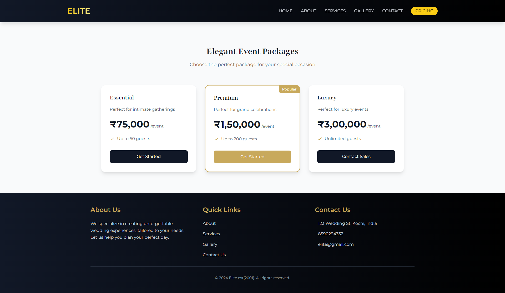

 # 🌟 My Tailwind Website
A modern and responsive website built with Tailwind CSS.
[![Made with Tailwind CSS]](https://tailwindcss.com)

## 🚀 Features
- Fully responsive design
 Modern UI components
 Custom animations
 Performance optimized

## 🛠️ Technologies Used
- Tailwind CSS
 HTML5
JavaScript
 Node.js

## 👥 Contributing

Contributions are always welcome! Here's how you can help:

## 📚 Documentation

For detailed documentation, please visit:
- [Tailwind CSS Documentation](https://tailwindcss.com/docs)
- [Project Wiki](https://github.com/yourusername/your-repo-name/wiki)

## 🚀 Homepage

## 🚀 About

## 🚀 Gallery

## 🚀 Service

## 🚀 Contact

## 🚀 Pricing

